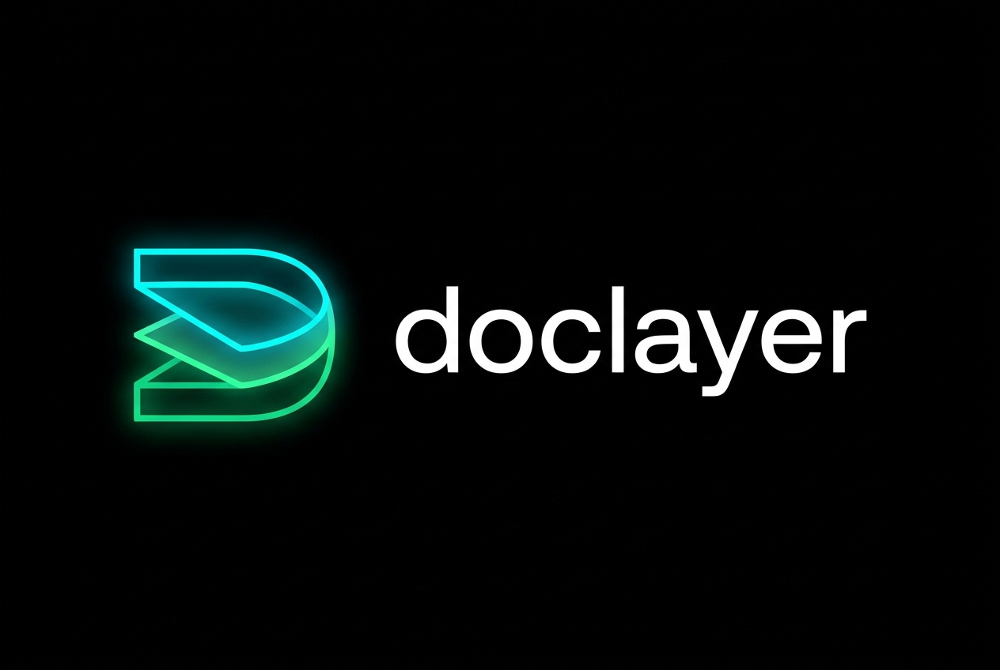

<p align="center">
  
</p>

<p align="center">
  <em>What engineers say must remain true. What AI agents must never break.</em>
</p>

<p align="center">
  
  
  
  
  
</p>

<p align="center">
  <strong>Durable engineering context & agent safety harness for software systems.</strong><br>
  Maintains architecture, invariants, decisions, epistemic rationales, and negative runbooks separate from the LLM context window and Git history.
</p>

---

## ⚡ The Problem & The Difference

<table>
<tr>
<th width="50%">❌ Autonomous Agent Without DocLayer</th>
<th width="50%">✅ Autonomous Agent With DocLayer</th>
</tr>
<tr>
<td valign="top">

* 💥 **Destructive Naive Fixes:** Hits `ERR_DB_LOCKED`, deletes `sqlite.db` or drops table to clear lock.
* 🤥 **Hallucinated Authority:** Inlines arbitrary magic numbers (`timeout = 10`) claiming "standard best practice" or inventing fake ADRs.
* 🔒 **Dogma Lock-In:** Discovers an undocumented workaround in code and hardcodes it as immutable architecture forever.
* 🚨 **Secret Leaks:** Accurately commits live API keys or credentials into documentation during scans.

</td>
<td valign="top">

* 🛡️ **Negative Invariant Guardrails:** Reads Section 3 Runbook: *"NEVER delete database to clear lock; wait 500ms backoff (`INC-109`)"*.
* 🧠 **Epistemic Certainty Tiers:** Explicitly tags machine constants as `STATED` (ADR/RFC), `[INFERRED]` (heuristic), or `UNREFERENCED` (Knowledge Debt).
* 🧱 **AST Invariant Drift Checks:** CI diagnostic (`doclayer check`) catches code constants diverging from declared contracts.
* 🔒 **Zero-Secret Boundary:** Built-in scanner rejects API keys, JWTs, and passwords before commit.

</td>
</tr>
</table>

---

## 🎯 The Core Model

```
                         THE SOFTWARE SYSTEM
                                  │
         ┌────────────────────────┼────────────────────────┐
         ↓                        ↓                        ↓
    SOURCE CODE                DOCLAYER                   GIT
 What the system          What engineers say            How both
   implements              must remain true             evolved
    src/*.py                .doclayer/*.md           VCS Commit Log
         │                        │                        │
         └────────────────────────┼────────────────────────┘
                                  │
                                  ▼
                            DRIFT CHECKER
                          (`doclayer check`)
                                  │
                                  ▼
             "Are declared contracts still aligned
                     with implementation?"
```

| Component | Responsibility |
| :--- | :--- |
| **Source Code** | **Implementation truth.** What the system actually executes. |
| **DocLayer (`.doclayer/*.md`)** | **Durable engineering context & contracts.** What engineers say must remain true across all environments. |
| **Git** | **Historical truth.** How code and contracts evolved over time. |
| **Drift Checker (`doclayer check`)** | **Diagnostic verification.** Validates invariant AST drift, audits epistemic knowledge debt, and checks secret safety without mutating files. |
| **AI Agent** | **Participant.** Reads context before coding; obeys negative runbook guardrails; proposes DocLayer updates when contracts change. |
| **Human Owner** | **Authority.** Reviews code + DocLayer diffs together during PR review; resolves knowledge debt prompts. |

---

## 📦 Installation & Setup

`doclayer` requires **Python 3.11+** (standard library `tomllib`) and has **zero external package dependencies**.

### 1. Developer CLI & CI

```bash
# Editable install from repo:
pip install -e .

# Or run directly without installation:
python -m doclayer.cli --help
```

### 2. For AI Coding Agents (Claude Code, Antigravity, Cursor, Codex)

DocLayer ships with a universal agent engineering directive in [`SKILL.md`](SKILL.md).

* **Antigravity / Gemini CLI:** Automatically discovers `SKILL.md` in repository root.
* **Claude Code / Codex:** Copy or symlink [`SKILL.md`](SKILL.md) into your project's `.agents/skills/doclayer/SKILL.md` or system prompt rules.
* **Any Agent:** Instruct your agent: *"Read `.doclayer/<subsystem>.md` before modifying code. Follow declared AST invariants and negative runbook prohibitions."*

---

## 🧠 The 4-Tier Epistemic Rationale Model

To prevent AI agents from hallucinating institutional authority or converting arbitrary heuristics into rigid dogma, DocLayer explicitly classifies rationale certainty into 4 tiers:

1. **Observed:** Machine-enforceable constant extracted directly from source code AST (`timeout_seconds = 3`).
2. **Stated:** Grounded in an explicit author ADR, RFC, or incident ticket (`Reference: ADR-042`).
3. **Inferred:** Heuristic hypothesis deduced by an AI agent or tooling, explicitly tagged (`[INFERRED]`).
4. **Unreferenced (Knowledge Debt):** Known implementation constraint observed in code whose institutional rationale is not yet recorded (`Reference: UNREFERENCED`).

---

## 🛡️ Agent Safety Runbooks (Negative Invariants)

Standard runbooks tell a human how to fix something. **Agent-Grade Runbooks encode what NOT to do** (Negative Invariants) to prevent destructive naive remediations by autonomous AI agents:

```markdown
## 3. Failure Modes & Agent Safety Runbook

| Symptom / Error | Probable Root Cause | Safe Remediation | Prohibited Actions (What NOT to do) | Reference |
| :--- | :--- | :--- | :--- | :--- |
| `ERR_DB_LOCKED` | SQLite file locked by external process | Wait 500ms and retry transaction | NEVER delete or recreate screener.db to clear a lock | `INC-109` |
```

---

## 📄 The Canonical 4-Section Subsystem Standard

````markdown
# Subsystem: Kubernetes Namespace & Resource Janitor

**Package:** `src/janitor.py`  
**Owner:** `@platform-infra` (Alerts: `EP-KUBE-JANITOR-TIER1`)

---

## 1. Overview & Topology
Daemon and CLI utility that scans Kubernetes clusters, reaps orphaned pods, and enforces resource TTLs.

```
[CronJob Trigger] ──> [Janitor Engine] ──> [K8s API Server]
```

---

## 2. Contracts & Invariants

```invariants
[invariants]
max_eviction_batch_size = 200
dry_run_default = true
default_ttl_hours = 24

[targets]
discovery_latency_target_ms = 200

[dependencies]
upstream = ["k8s-cronjob", "platform-cli"]
downstream = ["k8s-api-server", "slack-alerts-webhook"]
state_dependencies = ["k8s-etcd-state"]
identity_invariants = ["namespace_uid_immutable"]
safety_firewalls = ["never_delete_protected_namespaces"]
```

| Invariant / Contract | Why & Rationale | Reference | Evidence Anchor |
| :--- | :--- | :--- | :--- |
| `max_eviction_batch_size = 200` | Prevent etcd write serialization bottleneck | `RFC-204` | `src/janitor.py::MAX_EVICTION_BATCH_SIZE` |
| `dry_run_default = true` | Prevent accidental deletion during CLI runs | `INC-3301` | `src/janitor.py::DRY_RUN_DEFAULT` |
| `default_ttl_hours = 24` | Default preview namespace lifetime | `UNREFERENCED` | `src/janitor.py::DEFAULT_TTL_HOURS` |

---

## 3. Failure Modes & Agent Safety Runbook

| Symptom / Error | Probable Root Cause | Safe Remediation | Prohibited Actions (What NOT to do) | Reference |
| :--- | :--- | :--- | :--- | :--- |
| `ERR_API_THROTTLED` | Eviction rate hitting API server ceiling. | Verify batch size <= 200; back off. | Do not bypass rate limiting or spawn concurrent worker threads. | `RFC-204` |

---

## 4. References
* Implementation: `src/janitor.py`
* Incidents: `INC-3301`
* Architecture Decisions: `RFC-204`
````

---

## 🚀 CLI Commands & Workflows

### 1. Initialize Subsystem
```bash
doclayer init kube-janitor \
  --title "Kubernetes Namespace Janitor" \
  --package "src/janitor.py" \
  --owner "@platform-infra"
```

### 2. Verify Invariants & Check Knowledge Debt
```bash
# Standard validation
doclayer check

# Audit Knowledge Debt & Epistemic Certainty
doclayer check --debt

# Fast delta check for CI & Pre-Commit (<15ms)
doclayer check --changed
```

#### Output with Knowledge Debt Audit:
```text
doclayer check: Inspecting 1 subsystem layer file(s)...

 [PASS]  .doclayer/kube-janitor.md (Kubernetes Namespace Janitor)
         Invariants verified: max_eviction_batch_size, dry_run_default, default_ttl_hours
         Safety runbooks: 1 negative invariant guardrails active

------------------------------------------------------------
All 1 subsystem layers passed invariant and contract checks.

Knowledge Debt & Epistemic Audit:
  Overall Epistemic Certainty: 66.7% (2/3 grounded)
  Unreferenced Invariants:     1
  Inferred Heuristics:        0

  Subsystem              | Invariant                      | Status       | Action Required
  ------------------------------------------------------------------------------------------
  Kubernetes Namespace   | default_ttl_hours = 24         | UNREFERENCED | Constraint observed in code without institutional reference. Attach 1-line author rationale.
```

### 3. Inspect Subsystem Governance Profile
Ask *"What contracts, dependencies, and prohibitions govern this subsystem?"*:

```bash
doclayer inspect kube-janitor
```

### 4. Record Incident Post-Mortems (RCA)
```bash
doclayer rca \
  --subsystem kube-janitor \
  --incident INC-8820 \
  --decision "Enforce strict PDB timeout of 3s" \
  --rationale "Prevent janitor hanging on unresponsive PDB controllers" \
  --invariant "invariants.pdb_eval_timeout_seconds = 3" \
  --symptom "Janitor hung during eviction cycle" \
  --remediation "Inspect PDB health and verify timeout" \
  --prohibited "Do not force-evict pods when PDB controller is unreachable"
```

---

## ⚡ Performance & Scalability

Benchmarked with `scripts/benchmark_efficiency.py` across single-layer micro-benchmarks and synthetic monorepo stress tests (500+ subsystems):

| Operation | Latency (Avg) | Latency (P95) | Throughput |
| :--- | :--- | :--- | :--- |
| **Single Layer Parse & Extract** | **0.44 ms** | **0.88 ms** | ~2,250 layers/sec |
| **Schema & Contract Validation** | **0.75 ms** | **1.65 ms** | ~1,340 validations/sec |
| **50 Subsystems Monorepo Scan** | **218 ms** | — | 229 ops/sec (85 KB RAM) |
| **500 Subsystems Large Monorepo** | **2.17 s** | — | 230 ops/sec (635 KB RAM) |
| **Git Delta Target Resolution** | **<25 ms** | — | Zero full-repo overhead |

---

## 📜 License
Distributed under the [Apache License 2.0](LICENSE).
